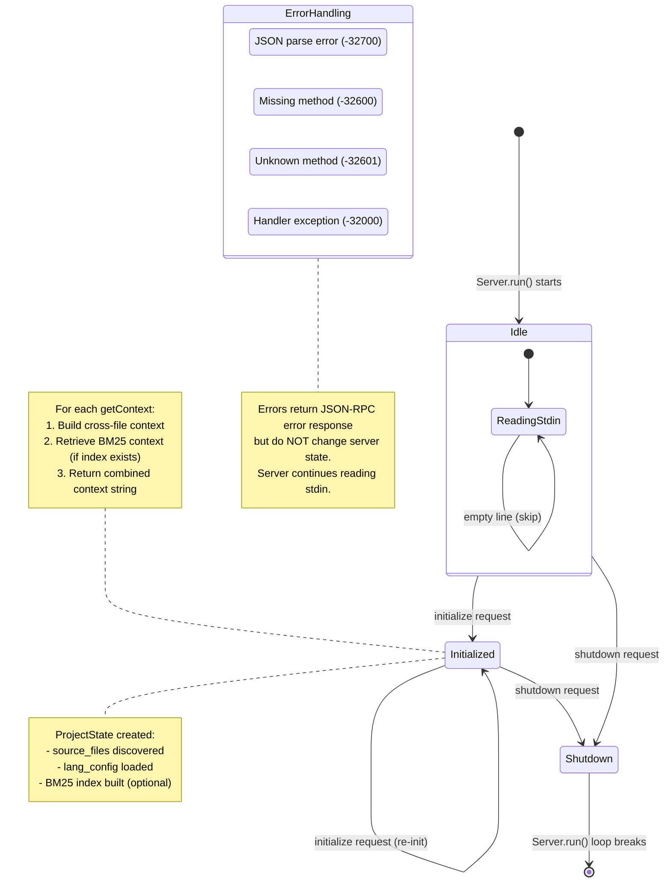
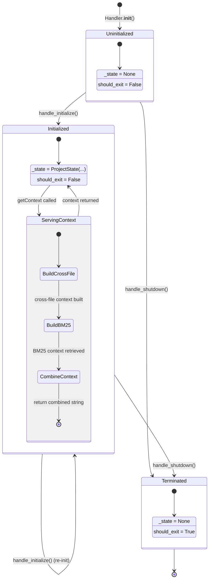
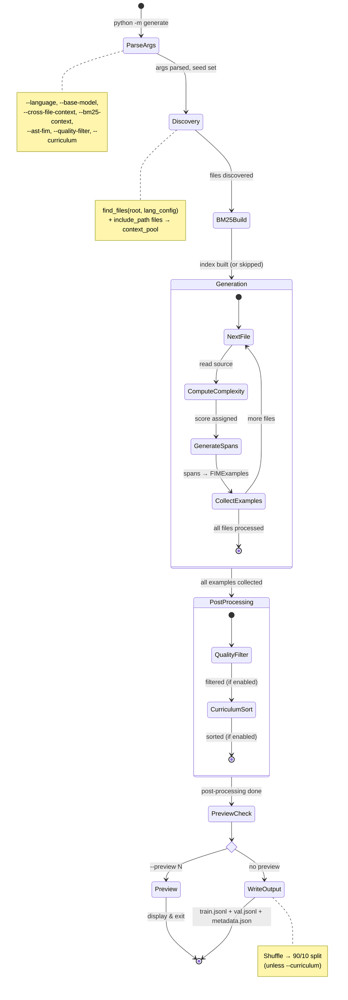
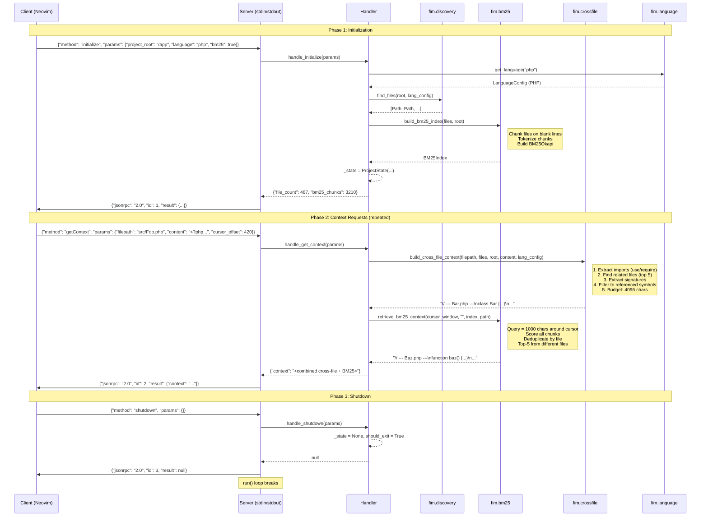
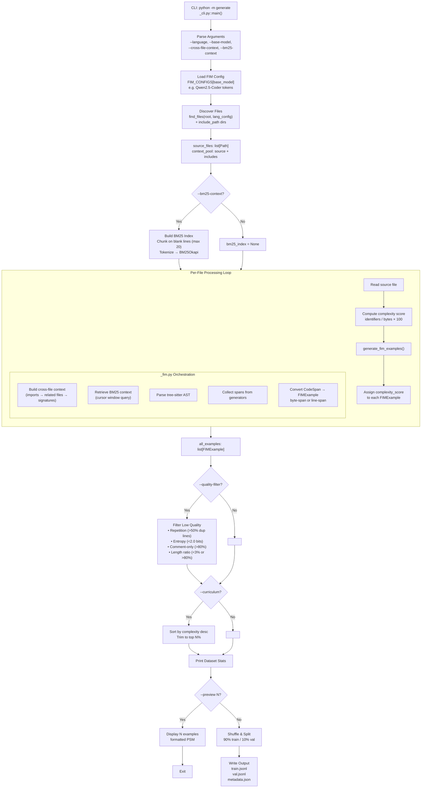
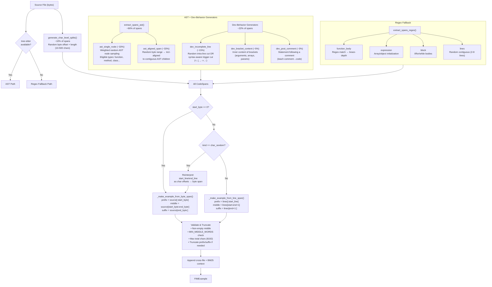
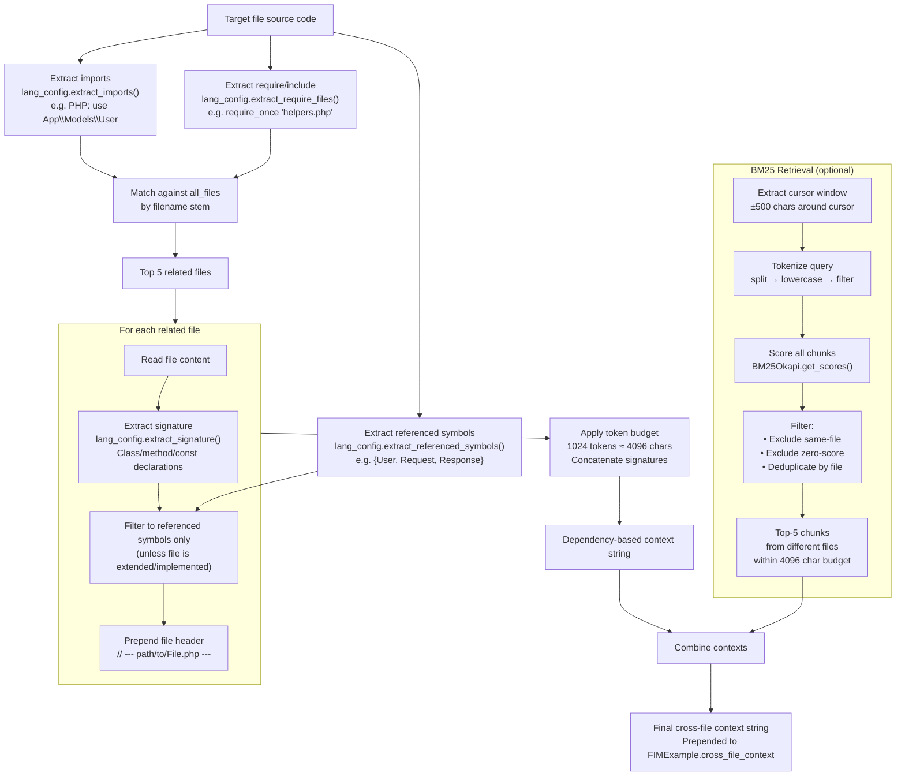

# FIM Architecture Diagrams

Detailed Mermaid diagrams documenting the **FIM Context Server** (`fimcontextserver/`) and **Dataset Generator** (`generate/`), both built on the shared `fim/` library.

---

## Table of Contents

1. [Context Server State Diagram](#1-context-server-state-diagram)
2. [Dataset Generator State Diagram](#2-dataset-generator-state-diagram)
3. [Class Diagram](#3-class-diagram)
4. [Context Server Sequence Diagram](#4-context-server-sequence-diagram)
5. [Dataset Generation Pipeline](#5-dataset-generation-pipeline)
6. [Span Generator Flow](#6-span-generator-flow)
7. [Cross-File Context Flow](#7-cross-file-context-flow)
8. [Package Dependency Graph](#8-package-dependency-graph)

---

## 1. Context Server State Diagram

The FIM Context Server is a JSON-RPC 2.0 process that communicates over stdin/stdout. It transitions through three states based on incoming RPC methods.

### Handler Internal State Transitions

---

## 2. Dataset Generator State Diagram

The generator runs as a batch CLI process with sequential phases.

---

## 3. Class Diagram

```mermaid
classDiagram
    direction TB

    class Server {
        -Handler _handler
        +run() void
        -_handle_line(line: str) dict|None
    }

    class Handler {
        -ProjectState|None _state
        +bool should_exit
        +handle_initialize(params: dict) dict
        +handle_get_context(params: dict) dict
        +handle_shutdown(params: dict) None
    }

    class ProjectState {
        +Path root
        +list~Path~ source_files
        +LanguageConfig lang_config
        +BM25Index|None bm25_index
        +dict sig_cache
    }

    class LanguageConfig {
        +str name
        +list~str~ extensions
        +str comment_prefix
        +set~str~ skip_dirs
        +list~str~ skip_patterns
        +Callable is_test_file
        +object|None ts_language
        +frozenset~str~ ast_eligible_types
        +set~str~ ast_bracket_types
        +set~str~ ast_ident_node_types
        +str ast_name_node_type
        +str regex_func_pattern
        +str regex_array_pattern
        +str regex_block_keywords
        +list~str~ trigger_tokens
        +Callable extract_imports
        +Callable extract_require_files
        +Callable extract_signature
        +Callable extract_referenced_symbols
    }

    class FIMConfig {
        +str prefix_tok
        +str suffix_tok
        +str middle_tok
        +str eot_tok
        +format_psm(prefix, middle, suffix) str
    }

    class CodeSpan {
        +str kind
        +int start_line
        +int end_line
        +str name
        +int indent
        +int start_byte
        +int end_byte
    }

    class FIMExample {
        +str filepath
        +str span_kind
        +str span_name
        +str prefix
        +str middle
        +str suffix
        +str cross_file_context
        +float complexity_score
        +int middle_lines
        +int total_lines
        +to_training_format(FIMConfig) dict
    }

    class BM25Index {
        +object bm25
        +list~str~ chunks
        +list~str~ chunk_files
    }

    %% Relationships
    Server "1" --> "1" Handler : owns
    Handler "1" --> "0..1" ProjectState : manages
    ProjectState "1" --> "1" LanguageConfig : uses
    ProjectState "1" --> "0..1" BM25Index : optional

    FIMExample ..> FIMConfig : formats with
    FIMExample ..> CodeSpan : created from

    %% Span generators
    class SpansAST {
        +extract_spans_ast(source, lang_config) list~CodeSpan~
        -_collect_eligible_nodes(node, types) list
        -_find_deepest_containing(node, start, end) Node
        -_aligned_span_from_random(src, tree, s, e) tuple
    }

    class SpansDevBehavior {
        +generate_incomplete_line_spans(source, tree, lc) list~CodeSpan~
        +generate_bracket_context_spans(source, tree, lc) list~CodeSpan~
        +generate_post_comment_spans(source, tree, lc) list~CodeSpan~
    }

    class SpansCharLevel {
        +generate_char_level_splits(source, num, min, max) list~CodeSpan~
    }

    class SpansRegex {
        +extract_spans_regex(source, lang_config) list~CodeSpan~
    }

    class FIMOrchestrator {
        +generate_fim_examples(filepath, source, ...) list~FIMExample~
        -_make_example_from_byte_span(...) FIMExample|None
        -_make_example_from_line_span(...) FIMExample|None
    }

    class Quality {
        +compute_complexity_score(source, lc) float
        +filter_low_quality_examples(examples) tuple
        +print_dataset_stats(examples, rejected) void
        -_char_entropy(text) float
    }

    class CLI {
        +main() void
        +build_argument_parser() ArgumentParser
        -discover_files(...) tuple
        -build_optional_bm25(...) BM25Index|None
        -generate_all_examples(...) tuple
        -apply_postprocessing(...) tuple
        -write_output(...) void
        -preview_examples(...) void
    }

    %% Generation relationships
    FIMOrchestrator ..> SpansAST : collects spans
    FIMOrchestrator ..> SpansDevBehavior : collects spans
    FIMOrchestrator ..> SpansCharLevel : collects spans
    FIMOrchestrator ..> SpansRegex : collects spans (fallback)
    FIMOrchestrator ..> CodeSpan : produces
    FIMOrchestrator ..> FIMExample : creates

    CLI --> FIMOrchestrator : calls per file
    CLI --> Quality : post-processing

    SpansAST ..> LanguageConfig : reads ast_eligible_types
    SpansDevBehavior ..> LanguageConfig : reads trigger_tokens, bracket_types
    SpansRegex ..> LanguageConfig : reads regex patterns

    %% Shared library functions
    class Discovery {
        +find_files(root, lang_config, tested_only) list~Path~
        +find_php_files(root, tested_only) list~Path~
    }

    class CrossFile {
        +build_cross_file_context(filepath, files, root, source, ...) str
        +find_related_files(filepath, files, root, source, lc) list~Path~
        +extract_file_signature(source, filepath, symbols, max_lines) str
        -_extract_referenced_symbols(source, lc) set~str~
    }

    class BM25Module {
        +build_bm25_index(files, root) BM25Index|None
        +retrieve_bm25_context(span, adj, index, path, ...) str
        -_tokenize_code(text) list~str~
    }

    Handler ..> Discovery : find_files()
    Handler ..> CrossFile : build_cross_file_context()
    Handler ..> BM25Module : build/retrieve
    FIMOrchestrator ..> CrossFile : build_cross_file_context()
    FIMOrchestrator ..> BM25Module : retrieve_bm25_context()
    CLI ..> Discovery : find_files()
    CLI ..> BM25Module : build_bm25_index()
```

---

## 4. Context Server Sequence Diagram

Shows the full lifecycle of a client session with the FIM Context Server.

---

## 5. Dataset Generation Pipeline

End-to-end flow of `python -m generate /path/to/project`.

---

## 6. Span Generator Flow

How spans are collected and their approximate distribution.

---

## 7. Cross-File Context Flow

How cross-file context is built (shared by both server and generator).

---

## 8. Package Dependency Graph

How the three packages relate and their external dependencies.

```mermaid
flowchart TB
    subgraph External["External Dependencies"]
        TS["tree-sitter<br/>(optional)"]
        TSLang["tree-sitter-php<br/>tree-sitter-python<br/>... (17 languages)"]
        RankBM25["rank-bm25<br/>(optional)"]
        TQDM["tqdm"]
    end

    subgraph FIM["fim/ (shared library)"]
        direction TB
        Types["types.py<br/>FIMConfig, CodeSpan,<br/>FIMExample, BM25Index"]
        Deps["deps.py<br/>HAS_TREE_SITTER,<br/>HAS_BM25"]
        Lang["language.py<br/>LanguageConfig,<br/>register(), get_language()"]
        Langs["languages/<br/>17 language modules<br/>_php, _python, _lua, ..."]
        Discovery["discovery.py<br/>find_files()"]
        CrossFile["crossfile.py<br/>build_cross_file_context()"]
        BM25Mod["bm25.py<br/>build_bm25_index(),<br/>retrieve_bm25_context()"]

        Langs --> Lang
        Discovery --> Lang
        CrossFile --> Lang
        BM25Mod --> Deps
        BM25Mod --> Types
    end

    subgraph Generate["generate/ (CLI dataset builder)"]
        direction TB
        GenCLI["_cli.py<br/>main(), argument parsing"]
        GenFIM["_fim.py<br/>generate_fim_examples()"]
        GenQuality["_quality.py<br/>filter, complexity, stats"]
        SpansAST["_spans_ast.py<br/>AST node/aligned spans"]
        SpansDB["_spans_devbehavior.py<br/>incomplete line, bracket, comment"]
        SpansChar["_spans_charlevel.py<br/>random char splits"]
        SpansRegex["_spans_regex.py<br/>regex fallback spans"]

        GenCLI --> GenFIM
        GenCLI --> GenQuality
        GenFIM --> SpansAST
        GenFIM --> SpansDB
        GenFIM --> SpansChar
        GenFIM --> SpansRegex
    end

    subgraph FIMServer["fimcontextserver/ (JSON-RPC server)"]
        direction TB
        Main["__main__.py<br/>CLI entry, logging setup"]
        Srv["_server.py<br/>Server: stdin/stdout loop"]
        Hdl["_handler.py<br/>Handler: dispatch + ProjectState"]

        Main --> Srv
        Srv --> Hdl
    end

    %% Cross-package dependencies
    GenFIM --> CrossFile
    GenFIM --> BM25Mod
    GenCLI --> Discovery
    GenCLI --> BM25Mod
    GenCLI --> Types
    SpansAST --> Lang
    SpansDB --> Lang
    SpansRegex --> Lang
    GenQuality --> Lang

    Hdl --> Discovery
    Hdl --> CrossFile
    Hdl --> BM25Mod
    Hdl --> Lang
    Hdl --> Deps
    Hdl --> Types

    %% External deps
    TS -.-> Deps
    TSLang -.-> Langs
    RankBM25 -.-> Deps
    TQDM -.-> GenCLI

    style External fill:#f5f5f5,stroke:#999
    style FIM fill:#e8f4f8,stroke:#4a9aba
    style Generate fill:#f0e8f4,stroke:#7a4aba
    style FIMServer fill:#e8f4e8,stroke:#4aba4a
```

---

## Span Type Summary

| Generator | Span Kind | Weight | Offset Type | Requires |
|-----------|-----------|--------|-------------|----------|
| `_spans_ast` | `ast_single_node` | ~33% | byte | tree-sitter |
| `_spans_ast` | `ast_aligned_span` | ~33% | byte | tree-sitter |
| `_spans_devbehavior` | `dev_incomplete_line` | ~15% | byte | tree-sitter (partial) |
| `_spans_devbehavior` | `dev_bracket_content` | ~5% | byte | tree-sitter |
| `_spans_devbehavior` | `dev_post_comment` | ~3% | byte | tree-sitter |
| `_spans_charlevel` | `char_random` | ~10% | char (in line fields) | none |
| `_spans_regex` | `function_body` | fallback | line | none |
| `_spans_regex` | `expression` | fallback | line | none |
| `_spans_regex` | `block` | fallback | line | none |
| `_spans_regex` | `lines` | fallback | line | none |

## Quality Filters

| Filter | Threshold | Catches |
|--------|-----------|---------|
| Repetition | >50% duplicate lines | Copy-paste, boilerplate |
| Entropy | <2.0 bits (Shannon) | Whitespace, repeated chars |
| Comment-only | >80% comment lines | Documentation blocks |
| Length ratio | <3% or >80% of total | Imbalanced examples |
